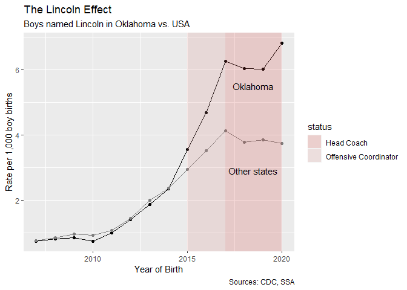

The Lincoln Effect
================

Thanks to some prodding from all-around good guy Ben Welsh at the LA
Times, I decided to take a look at Oklahoma boys who are named Lincoln
in light of L’Affair Riley at OU.

It’s a good opportunity to tinker with ggplot’s features.

Load our libraries.

``` r
library(fs)
library(tidyverse)
```

    ## -- Attaching packages --------------------------------------- tidyverse 1.3.1 --

    ## v ggplot2 3.3.5     v purrr   0.3.4
    ## v tibble  3.1.5     v dplyr   1.0.7
    ## v tidyr   1.1.4     v stringr 1.4.0
    ## v readr   2.0.2     v forcats 0.5.1

    ## -- Conflicts ------------------------------------------ tidyverse_conflicts() --
    ## x dplyr::filter() masks stats::filter()
    ## x dplyr::lag()    masks stats::lag()

``` r
library(ggplot2)
```

## Baby names

You can [find the baby names
here](https://catalog.data.gov/dataset/baby-names-from-social-security-card-applications-state-and-district-of-columbia-data).
It’s Social Security Administration data based on applications.

One limitation to this data is that it only includes names where n>5.

Below is the code to download it, but I’ve commented it out because the
data is in the Github repo.

``` r
#download.file("https://www.ssa.gov/oact/babynames/state/namesbystate.zip", destfile="./data/namesbystate.zip")
```

And let’s unzip it.

``` r
unzip("./data/namesbystate.zip", exdir="./data/names_by_state")
```

OK. So we have each state’s data in a separate file. That’s unfortunate.
We’ll use the FS package to cycle through each of them and import into a
single table.

First let’s grab the path of all the CSVs in the directory.

``` r
raw_file_list <- dir_ls("./data/names_by_state", glob="*.TXT") 
```

Now read them into a single table…

``` r
raw_imported_data <- raw_file_list %>%
  map_df(read_csv, col_names = FALSE, show_col_types = FALSE)
```

Let’s add file headers.

``` r
raw_imported_ready <- raw_imported_data %>%
  rename(state=X1, sex=X2, birth_year=X3, name=X4, count=X5) 
```

OK, first let’s check the popularity of Lincoln.

``` r
raw_imported_ready %>%
  filter(name=="Lincoln" & sex=="M" & state=="OK" & birth_year >= 2000) %>%
  ggplot(aes(x=birth_year, y=count)) + 
  geom_line() +
  geom_point() + 
  scale_x_continuous(breaks = seq(2000, 2021, by = 5))
```

<!-- -->

OK, that’s interesting. But we really need to compare to other states.
And to do that, we need to control for the number of births in each
state.

To do that, we need the CDC’s count of births by state by year.
Unfortunately, I don’t think you can get state-level births via an API,
so I downloaded the data [from CDC Wonder](https://wonder.cdc.gov/).

I downloaded births by state and by year.

Let’s import the data and clean the column names..

``` r
natality_07_20 <- read_tsv("./data/natality_07_20.txt") %>%
  janitor::clean_names() 
```

    ## Rows: 2177 Columns: 8

    ## -- Column specification --------------------------------------------------------
    ## Delimiter: "\t"
    ## chr (5): Notes, State, State Code, Gender, Gender Code
    ## dbl (3): Year, Year Code, Births

    ## 
    ## i Use `spec()` to retrieve the full column specification for this data.
    ## i Specify the column types or set `show_col_types = FALSE` to quiet this message.

I noticed they slyly included the totals for each year in the files.
Let’s toss em. And trim column names.

``` r
natality_07_20 <- natality_07_20 %>%
  filter(is.na(notes)) %>%
  filter(gender=="Male") %>%
  select(year_code:births) 
```

    ## Warning: One or more parsing issues, see `problems()` for details

Let’s use [this little package](https://github.com/OpenIntroStat/usdata)
to add abbreviation names.

``` r
natality_07_20_ready <- natality_07_20 %>%
  janitor::clean_names() %>%
  mutate(state_abbrev = usdata::state2abbr(state)) %>%
  select(year_code, state_abbrev, births)
```

And let’s put it all together.

Note: Limiting to \>= 2007 to match natality data.

``` r
finished_data <- raw_imported_ready %>%
  filter(name=="Lincoln" & sex=="M" & birth_year >= 2007) %>%
  left_join(natality_07_20_ready, by=c("state" = "state_abbrev", "birth_year" = "year_code")) %>%
  select(state, birth_year, count, births) %>%
  mutate(rate_per_1000 = (count / births) * 1000) 
```

We really need to compare against the national rate minus Oklahoma. This
little chunk of code calculates that and stores it in an object for
later use in ggplot.

``` r
national_rate <- finished_data %>%
  filter(!state=="OK") %>%
  filter(birth_year >= 2007) %>%
  select(birth_year, count, births) %>%
  group_by(birth_year) %>%
  summarise(total_lincolns = sum(count),
            total_births = sum(births)) %>%
  mutate(lincoln_rate_per_1000 = (total_lincolns / total_births) * 1000)
```

Let’s make a tribble to hold our time periods.

``` r
coaching_periods <- tribble(
  ~start, ~end, ~status,
  2015, 2017, "Offensive Coordinator",
  2017, 2020, "Head Coach"
)
```

And let’s use that to introduce better shading.

Before moving on, let’s also store Oklahoma’s calculations in its own
object for cleaner ggplot code.

``` r
oklahoma_data <- finished_data %>%
  filter(state == "OK")
```

Let’s put it all together. I’m too lazy to tinker with the colors too
much.

``` r
ggplot(oklahoma_data) + 
  geom_line(aes(x=birth_year, y=rate_per_1000), color="black") +
  geom_point(aes(x=birth_year, y=rate_per_1000), color="black") + 
  geom_line(data=national_rate, aes(x=birth_year, y=lincoln_rate_per_1000), colour = "grey50") + 
  geom_point(data=national_rate, aes(x=birth_year, y=lincoln_rate_per_1000), colour = "grey50") + 
  geom_rect(data=coaching_periods, aes(xmin=start, xmax=end, fill = status), ymin = -Inf, ymax = Inf, alpha = 0.2) +
  scale_fill_manual(values = c("#d1433b", "#d68e89")) +
  labs(title="The Lincoln Effect", subtitle="Boys named Lincoln in Oklahoma vs. USA", caption="Sources: CDC, SSA") +
  xlab("Year of Birth") +
  ylab("Rate per 1,000 boy births") +
  annotate("text", x = 2018.5, y = 2.9, label = "Other states") +
  annotate("text", x = 2018.5, y = 5.5, label = "Oklahoma") 
```

<!-- -->

Voila!
